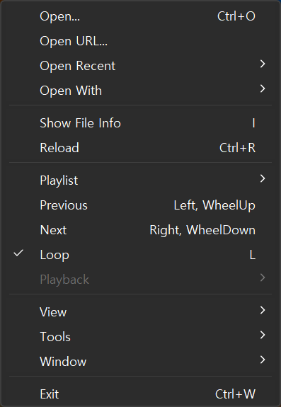
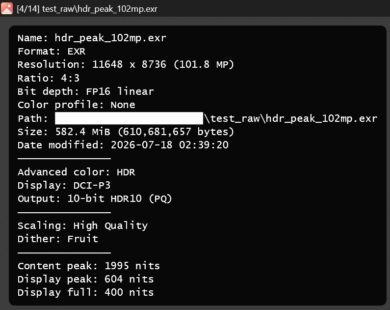

# riv

A fast, precise, minimal image viewer for Windows.

<p align="center">
  
  &nbsp;
  
</p>

## Features

- HDR and native 10-bit output: scRGB FP16 render pipeline
- Display-adaptive HDR: passthrough on HDR displays, tone-mapped to SDR
- Color management: embedded ICC profiles, PQ/HLG sources, Windows Advanced Color
- Ordered or Fruit output dither shader
- Animation playback (GIF, APNG, animated WebP) with pause, frame stepping, and speed control
- Browse images inside archives (via archiveint.dll, shipped with Windows)
- Open http/https image URLs (via curl.exe, shipped with Windows)
- Per-extension file associations, reversible with no registry leftovers
- Configurable preloading that follows the browsing direction
- Single portable executable (~7 MB), no installation
- Settings stored in `riv.json` next to `riv.exe`

Running as administrator is blocked at startup.

## Supported formats

Some formats need a codec extension from the Microsoft Store. Only those
files fail without it; the error names the one to install:

| Format | Required extension |
|---|---|
| HEIC / HEIF † | HEVC Video Extensions (Microsoft Corporation) |
| AVIF ‡ | AV1 Video Extension (Microsoft Corporation) |
| JPEG XL ‡ | JPEG XL Image Extension (Microsoft Corporation) |
| WebP (still) ‡ | WebP Image Extensions (Microsoft Corporation) |
| Camera RAW ‡ | Raw Image Extension (Microsoft Corporation) |

† paid · ‡ free, no sign-in required

HEVC Video Extensions is optional; without it, the app uses its built-in decoder.

Decoded by built-in codecs:

| Format | Decoder |
|---|---|
| HEIC / HEIF | libheif + libde265 § |
| SVG / SVGZ | resvg |
| EXR | OpenEXR |
| APNG | png |
| Animated WebP | libwebp |

§ 8-bit output: 10-bit and HDR HEIC still decode, reduced to 8-bit.
By contrast, HEVC Video Extensions keeps the full depth.

Decoded by Windows Imaging Component codecs:

| Format | Notes |
|---|---|
| PNG, JPEG, GIF, BMP, ICO, TIFF | |
| DDS | BC1–BC3 |

Archives browsable as image folders:
zip, 7z, rar, tar, and cbz / cbr / cb7 / cbt.

## Requirements

- Windows 11, x86-64
- Direct3D 12 capable GPU

## Building

The build cross-compiles from Linux (tested on WSL) to `x86_64-pc-windows-msvc`.

Prerequisites:

- Rust with the `x86_64-pc-windows-msvc` target
- LLVM 21+: clang-cl, lld-link, llvm-lib, llvm-rc, llvm-mt
- A Windows CRT + SDK splat from [xwin](https://github.com/Jake-Shadle/xwin)
  in `~/.xwin` (override the location with `XWIN_ROOT`)
- CMake and Ninja, for static codec dependencies

On Ubuntu 26.04, everything but Rust and xwin comes from apt:

```sh
sudo apt-get install clang-21 lld-21 llvm-21 cmake ninja-build git
```

Rust and xwin:

```sh
curl --proto '=https' --tlsv1.2 -sSf https://sh.rustup.rs | sh
rustup target add x86_64-pc-windows-msvc
cargo install xwin
xwin --accept-license splat --output ~/.xwin
```

```sh
./deps/build_deps.sh   # static build of the C/C++ codecs
cargo build --release
```

## Acknowledgments

Inspired by [qView](https://github.com/jurplel/qView).
[mpv](https://github.com/mpv-player/mpv) and
[libplacebo](https://code.videolan.org/videolan/libplacebo) served as references
for context menu, dither, aspect ratio table, and HDR pipeline.

## License

GPL-3.0-only (see [LICENSE](LICENSE)).

[THIRD-PARTY-NOTICES.md](THIRD-PARTY-NOTICES.md) lists the statically linked
third-party components and their licenses. The application icon is derived
from [Fluent UI System Icons](https://github.com/microsoft/fluentui-system-icons) (MIT).
