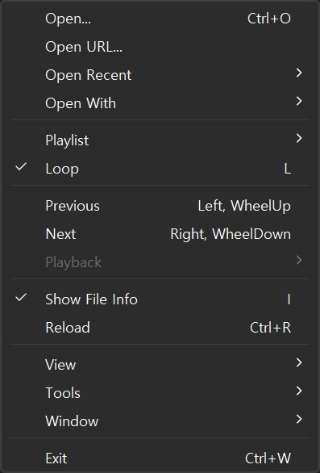
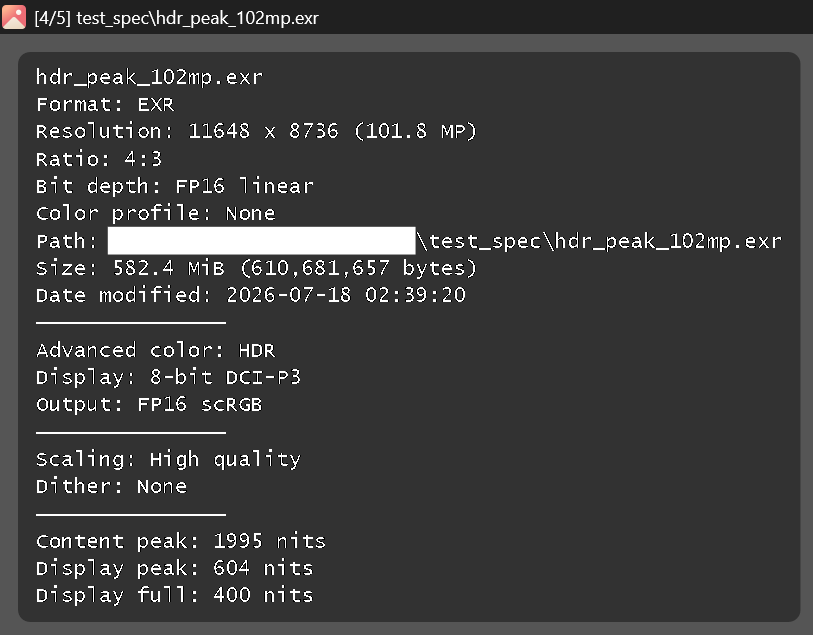

# riv

A fast, precise, minimal image viewer for Windows.

<p align="center">
  
  &nbsp;
  
</p>

## Features

- Rendering
  - FP16 linear render pipeline, FP16 scRGB output on Windows Advanced Color
  - HDR passthrough on HDR displays, HDR tone-mapped on SDR displays
  - Ultra HDR gain maps on HDR displays, display-adapted
  - Output dither on 8-bit: Ordered or Fruit
  - Windows Advanced Color: WCG/HDR, PQ/HLG, embedded/display ICC profiles
- Browsing
  - Browse images inside archives (via archiveint.dll, shipped with Windows)
  - Open http/https image URLs (via curl.exe, shipped with Windows)
  - Animation playback with pause, frame stepping, speed control
  - Configurable preloading that follows the browsing direction
- Application
  - Customizable keyboard and mouse shortcuts
  - Per-extension file associations, reversible with no registry leftovers
  - Single portable executable, no installation
  - Settings stored in `riv.json` next to `riv.exe`

Running as administrator is blocked at startup.

## Supported formats

Formats that need a codec extension from the Microsoft Store:

| Format | Required extension | Notes |
|---|---|---|
| AVIF | HEIF Image Extension + AV1 Video Extension (Microsoft Corporation) | HDR / Tone map |
| JPEG XL | JPEG XL Image Extension (Microsoft Corporation) | HDR / Tone map |
| WebP | WebP Image Extensions (Microsoft Corporation) | Still only |
| Camera RAW | Raw Image Extension (Microsoft Corporation) | |

**Required extensions are free and need no sign-in.**

Formats with an optional codec extension:

| Format | Optional extension | Notes |
|---|---|---|
| HEIC / HEIF | HEIF Image Extension + HEVC Video Extensions (Microsoft Corporation) | HDR / Tone map |

**HEVC Video Extensions is paid.**

`HEVC Video Extensions from Device Manufacturer (Microsoft Corporation)` is the
same codec for free, but it installs only on eligible devices.

When either HEVC extension is installed, it takes precedence; otherwise the
built-in decoder handles HEIC / HEIF. Neither is required.

Decoded by built-in codecs:

| Format | Decoder | Notes |
|---|---|---|
| HEIC / HEIF | libheif + libde265 | HDR / Tone map |
| EXR | OpenEXR | HDR / Tone map |
| PNG | png | Animated only |
| WebP | libwebp | Animated only |
| SVG / SVGZ | resvg | Vector only |

Decoded by Windows Imaging Component codecs:

| Format | Notes |
|---|---|
| JPEG | Ultra HDR |
| JPEG XR | HDR / Tone map |
| DDS | BC1-BC3 |
| BMP, GIF, ICO, PNG, TIFF | |

Archives browsable as image folders:
zip, 7z, rar, tar, and cbz / cbr / cb7 / cbt.

## Requirements

- Windows 11 23H2 or later, x86-64-v3 (AVX2)
- Direct3D 12 capable GPU

## Building

The build cross-compiles from Linux (tested on WSL) to `x86_64-pc-windows-msvc`.

Prerequisites:

- Rust with the `x86_64-pc-windows-msvc` target.
- LLVM 22: `clang, clang-cl, lld-link, llvm-lib, llvm-rc, llvm-mt`.
  Older releases can fail on the MSVC STL in the xwin splat.
- A Windows CRT + SDK splat from [xwin](https://github.com/Jake-Shadle/xwin)
  in `~/.xwin` (override the location with `XWIN_ROOT`).
- `CMake` and `Ninja`, for static codec dependencies.
- `Wine`, for the tests and for compiling the HLSL shaders.

On Ubuntu 26.04, everything but Rust and xwin comes from apt:

```sh
sudo apt-get install clang-22 lld-22 llvm-22 cmake ninja-build wine git
```

Only the versioned directory carries the unversioned tool names:

```sh
export PATH="/usr/lib/llvm-22/bin:$PATH"
```

Rust and xwin:

```sh
curl --proto '=https' --tlsv1.2 -sSf https://sh.rustup.rs | sh
rustup target add x86_64-pc-windows-msvc
cargo install xwin
xwin --accept-license splat --output ~/.xwin
```

```sh
./deps/build_deps.sh   # static build of the C/C++ codecs
cargo build --release
```

## Acknowledgments

Inspired by [qView](https://github.com/jurplel/qView).

[mpv](https://github.com/mpv-player/mpv) and
[libplacebo](https://code.videolan.org/videolan/libplacebo) served as references
for the context menu, dithering, and the aspect ratio table.

Ultra HDR test images come from
[Mishaal Rahman's samples](https://github.com/MishaalRahmanGH/Ultra_HDR_Samples),
with SDR emulations by Dylan Raga (CC BY 4.0).

## License

GPL-3.0-only (see [LICENSE](LICENSE)).

[THIRD-PARTY-NOTICES.md](THIRD-PARTY-NOTICES.md) lists the statically linked
third-party components and their licenses. The application icon is derived
from [Fluent UI System Icons](https://github.com/microsoft/fluentui-system-icons) (MIT).
